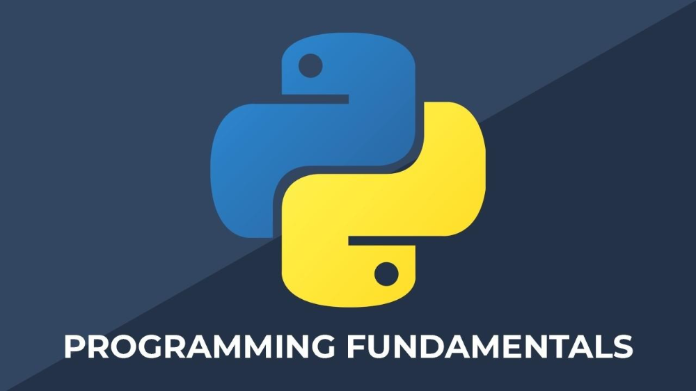

<!-- LOGO -->
<br />
<div align="center">
  <a href="https://github.com/Labpro-21/if1210-2024-tubes-k10-g">
    
  </a>

  <h3 align="center">TUGAS BESAR</h3>

  <p align="center">
    IF1210 Dasar Pemrograman
    <br />
    <a href="https://github.com/Labpro-21/if1210-2024-tubes-k10-g/tree/main/doc"><strong>Laporan »</strong></a>
    <br />
    <br />
  </p>
</div>

<!-- TABLE OF CONTENTS -->
<details>
  <summary>Table of Contents</summary>
  <ol>
    <li>
        <a href="#about-the-project">About The Project</a>
        <ul>
            <li><a href="#specification">Specification</a></li>
            <li><a href="#built-with">Built With</a></li>
            <li><a href="#project-structure">Project Structure</a></li>
        </ul>
    </li>
    <li>
        <a href="#getting-started">Getting Started</a>
        <ul>
            <li><a href="#installation">Installation</a></li>
        </ul>
    </li>
    <li>
        <a href="#authors">Author</a>
    </li>
  </ol>
</details>
<br/>
<br/>

<!-- ABOUT THE PROJECT -->
## About The Project

Tugas Besar IF1210 K10-G

Tugas ini diberikan kepada mahasiswa TPB STEI 2023 pada Semester 2 tahun ajaran 2023/2024. Tugas dikerjakan secara berkelompok, dengan anggota tiap kelompok 5 orang.

### Specification

* Program is able to read data from a CSV file
* Program is able to write data into a CSV file
* Program is able to register a new user into the database
* Program is able to log in to an existing user inside the database
* Program is able to generate a random number using LCG algorithm
* Program is able to simulate a turn-based battle system against random monsters
* Program is able to simulate a 5-stage battle arena against increasingly difficult monsters
* Program is able to simulate a shop where item can be bought and stored in the database
* Program is able to simulate an upgrade system for the user's monsters
* Program is able to manage the shop and the monster in the database from within the program
* Program is able to show all the commands available to the user

### Built With
[![Python][Python.py]][Python-url]

### Project Structure
```ssh
.
├─── README.md                  # Driver
│    main.py                    
├─── data                       # CSV files
├─── src                        # Source code
│    ├── __init__.py
│    ├── arena.py
│    ├── battle.py
│    ├── csv_parser.py
│    ├── exit.py
│    ├── healingfountain.py
│    ├── help.py
│    ├── inventory.py
│    ├── laboratory.py
│    ├── load.py
│    ├── login.py
│    ├── monster_ball.py
│    ├── monster_management.py
│    ├── register.py
│    ├── rng.py
│    ├── save.py
│    ├── shop_management.py
│    ├── shop.py
│    ├── types.py
│    └── utils.py
└───doc                         # Documentation
```
<br/>
<br/>

<!-- GETTING STARTED -->
## Getting Started

### Installation
1. Clone the repo
   ```sh
   git clone https://github.com/Labpro-21/if1210-2024-tubes-k10-g.git
   ```
2. Go to the repository root folder `if1210-2024-tubes-k10-g`
   ```sh
   cd if1210-2024-tubes-k10-g
   ```
3. Run the program `main.py`
   ```sh
   python main.py
   ```
<br/>
<br/>

<!-- AUTHOR -->
### Authors

| NIM | Name | Contribution |
| :---: | :---: | :---: |
| 19623099 | Daniel Pedrosa Wu | 
| 19623039 | Devon Wiraditya Tanumihardja | 
| 19623049 | Darryl Rayhananta Adenan | 
| 19623189 | Muhammad Aymar Barkhaya | 
| 16523199 | Fathur Rahman Arahkal | 
